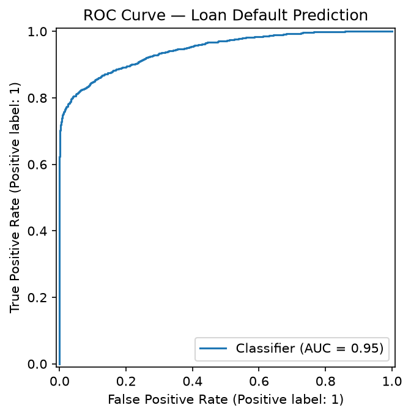
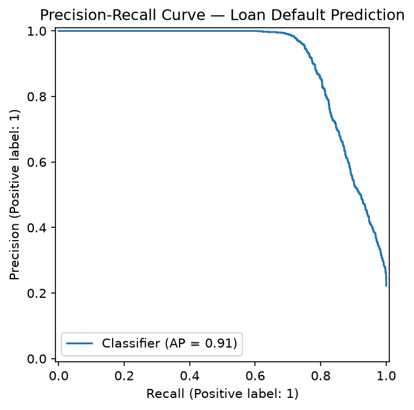
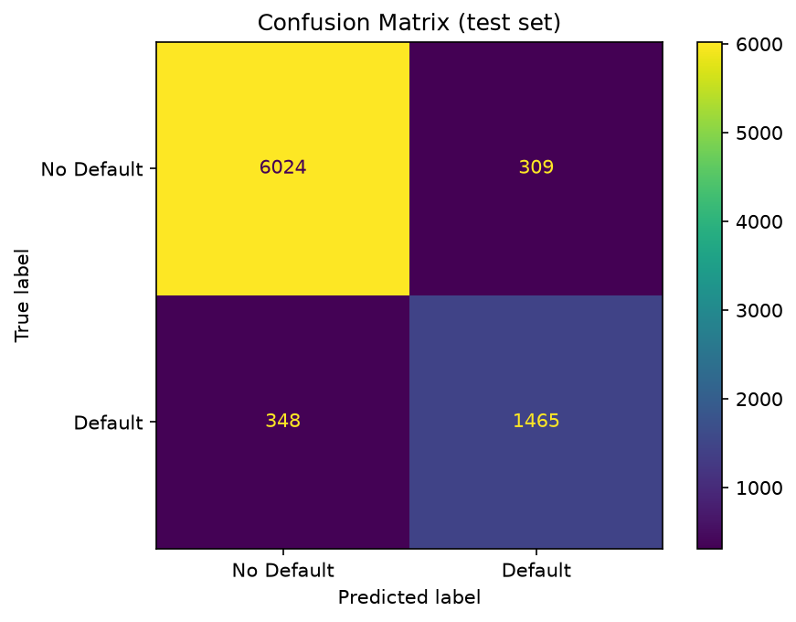
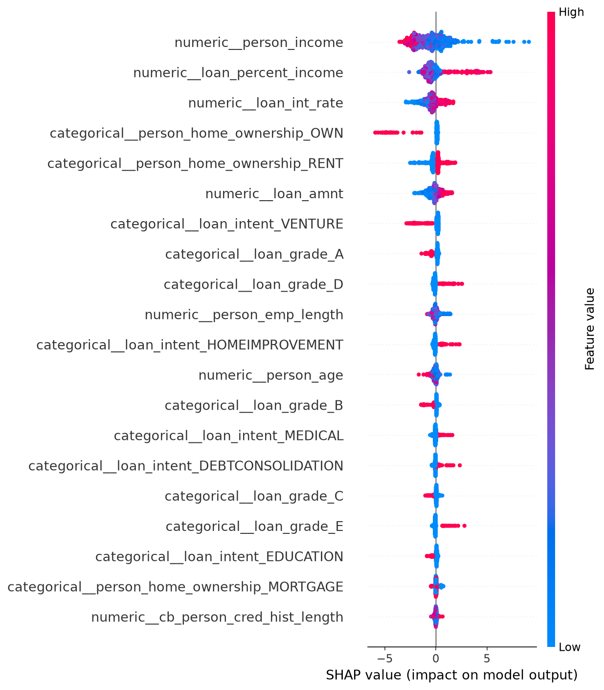

# 💰 Loan Default Prediction System

A machine learning system that predicts the probability a borrower defaults on a loan, served through a FastAPI endpoint. Built on the [Credit Risk Dataset](https://github.com/naaim04/Loan-default-prediction-system) (~24K historical loans).

**Stack:** scikit-learn + XGBoost (modeling) · SHAP (explainability) · FastAPI (serving) · pytest + GitHub Actions (testing/CI)

---

## Architecture

```
data/                   credit_risk_train.csv, credit_risk_test.csv, loan_requests.csv
src/loan_default/
  data.py               load + clean (impute missing, drop impossible outliers)
  features.py           ColumnTransformer: median/mode imputation, scaling, one-hot encoding
  train.py               tunes 3 model families via cross-validated random search, picks the best
  evaluate.py            metrics, ROC/PR/confusion-matrix plots, SHAP explainability
  predict.py             loads the persisted pipeline, scores new applicants
api/                    FastAPI service (/predict, /model/metadata, /health)
scripts/                batch scoring CLI over data/loan_requests.csv
models/                 persisted model.joblib + metrics.json (committed, tracks with the code)
reports/figures/        ROC curve, PR curve, confusion matrix, SHAP summary (generated by train.py)
tests/                  pytest — data cleaning, preprocessing, API
```

The same fitted `Pipeline` object (preprocessing + model, one artifact) is loaded by both the API and the batch script, so training and serving can never drift apart.

---

## Results

Trained on `credit_risk_train.csv`, evaluated on the untouched `credit_risk_test.csv` holdout (8,146 rows).

| Model | 5-fold CV ROC-AUC |
|---|---|
| Logistic Regression | 0.871 |
| Random Forest | 0.933 |
| **XGBoost (selected)** | **0.951** |

**Selected model — XGBoost — test set performance:**

| Metric | Score |
|---|---|
| ROC-AUC | 0.946 |
| PR-AUC | 0.905 |
| Accuracy | 91.9% |
| Precision (default class) | 0.826 |
| Recall (default class) | 0.808 |

Accuracy alone is misleading here: defaults are the minority class (~22% of loans), so a model that always predicts "no default" would score ~78% accuracy while catching zero actual defaults. ROC-AUC/PR-AUC and per-class precision/recall are what actually matter for a lender, which is why class weighting (`scale_pos_weight` for XGBoost, `class_weight="balanced"` for the others) is applied during training.





### What drives the model's predictions



`person_income`, `loan_percent_income` (loan size relative to income), and `loan_int_rate` are the strongest drivers of predicted default risk — intuitive: borrowers with lower income, loans that consume a larger share of their income, and higher interest rates (itself a proxy for lender-assessed risk) are more likely to default.

---

## Run it locally

```bash
python -m venv .venv
.venv\Scripts\activate          # macOS/Linux: source .venv/bin/activate
pip install -r requirements.txt
```

**Train** (tunes all 3 models via cross-validated random search, saves the best pipeline + metrics + plots):

```bash
python -m src.loan_default.train
```

**Test:**

```bash
pytest
```

**Serve the API:**

```bash
uvicorn api.main:app --reload
```

Interactive docs at `http://localhost:8000/docs`. Example request:

```bash
curl -X POST http://localhost:8000/predict \
  -H "Content-Type: application/json" \
  -d '{
    "person_age": 29, "person_income": 82450, "person_home_ownership": "MORTGAGE",
    "person_emp_length": 11, "loan_intent": "MEDICAL", "loan_grade": "E",
    "loan_amnt": 7500, "loan_int_rate": 14.5, "loan_percent_income": 0.08,
    "cb_person_default_on_file": "N", "cb_person_cred_hist_length": 9
  }'
# {"default_probability":0.9688,"predicted_status":"default","risk_band":"high"}
```

**Batch-score sample applicants** (`data/loan_requests.csv`):

```bash
python -m scripts.score_loan_requests
```

**Docker:**

```bash
docker build -t loan-default-api .
docker run -p 8000:8000 loan-default-api
```

---

## Design decisions

- **`Pipeline` + `ColumnTransformer`** bundles preprocessing with the model, so the exact same imputation/scaling/encoding logic runs at train and inference time, and cross-validation never leaks test-fold statistics into training.
- **Missing values are imputed, not dropped** — `loan_int_rate` is missing in ~9% of rows and `person_emp_length` in ~3%; dropping them (the original approach) throws away real data. Only physically impossible values (age up to 144, employment length far beyond a career) are dropped as data-entry errors.
- **Three model families compared**, not one — a linear baseline (Logistic Regression) alongside two tree ensembles (Random Forest, XGBoost), each tuned with `RandomizedSearchCV` over `StratifiedKFold` cross-validation, selected by ROC-AUC.
- **Class imbalance handled explicitly**, since the minority class (defaults) is the one a lender actually cares about catching.
- **SHAP** explains the winning model's predictions at both the global (which features matter) and per-prediction level — critical for a model whose decisions affect real credit outcomes.
- **CI (GitHub Actions)** runs the test suite on every push, using the committed model artifact so the pipeline and API are verified together.

---

## Future improvements

- Model monitoring for data/prediction drift once deployed
- Calibration check (are predicted probabilities well-calibrated, not just well-ranked?)
- A lightweight frontend for non-technical users to submit applications

---

## 👤 Author

**Aarish Naiyer**
GitHub: https://github.com/aarishnaiyer
LinkedIn: https://linkedin.com/in/aarishna
